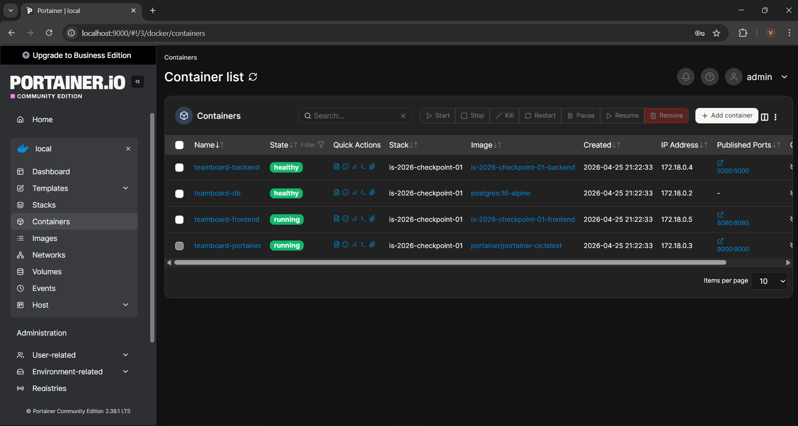

# is-2026-checkpoint-01 | TeamBoard App

**TeamBoard** es una aplicación web integral diseñada para visualizar los integrantes de un equipo de desarrollo, las funcionalidades (features) implementadas por cada uno y el estado de sus respectivos servicios. El sistema utiliza una arquitectura de microservicios orquestada con **Docker Compose**, donde el frontend consume datos de una API REST que, a su vez, consulta una base de datos PostgreSQL persistente.

## 👥 Tabla de Integrantes y Features
Este proyecto fue desarrollado por el siguiente grupo como parte de la materia Ingeniería y Calidad de Software (2026).

| Integrante | Legajo | Feature Asignada | Servicio Responsable |
| :--- | :--- | :--- | :--- |
| **Valentino Chiappini** | 33072 | **Feature 01**: Coordinación, Infraestructura Base y README <br> **Feature 05**: Panel de Monitoreo con Portainer  | Orquestación (Docker Compose) <br> Panel de Monitoreo con Portainer |
| **Sergio Adrian Maldonado** | 21352 | **Feature 02**: Página Web con HTML y JavaScript | Frontend |
| **Juan Ignacio Wilt** | 33151 | **Feature 03**: Backend API REST con Python y Flask | Backend |
| **Álvaro Marini** | 33133 | **Feature 04**: Base de Datos con PostgreSQL | Database |
---

## 🚀 Instrucciones de Clonación y Ejecución

Sigue estos pasos para poner en marcha la aplicación de extremo a extremo:

1.  **Clonar el repositorio:**
    ```bash
    git clone https://github.com/ValenCh/is-2026-checkpoint-01.git
    cd is-2026-checkpoint-01
    ```

2.  **Configurar variables de entorno:**
    Copia el archivo de ejemplo y completa los valores necesarios en el nuevo archivo `.env` (este archivo está excluido de Git por seguridad).
    ```bash
    cp .env.example .env
    ```

3.  **Construir y levantar los contenedores:**
    Utiliza Docker Compose para inicializar todos los servicios simultáneamente en segundo plano.
    ```bash
    docker compose up -d --build
    ```

4.  **Verificar el estado de los servicios:**
    Asegúrate de que todos los servicios estén en estado `running` (o `healthy`).
    ```bash
    docker compose ps
    ```

### 🔗 Accesos Directos
* **Página Principal (Frontend):** [http://localhost:8080](http://localhost:8080)
* **API Salud (Healthcheck):** [http://localhost:5000/api/health](http://localhost:5000/api/health)
* **API Datos (JSON):** [http://localhost:5000/api/team](http://localhost:5000/api/team)
* **Panel de Monitoreo (Portainer):** [http://localhost:9000](http://localhost:9000)

---

## 🛠️ Descripción de los Servicios

### 1. Frontend (Feature 02)
* **Tecnología:** Python 3.12-slim (`http.server`), HTML5, CSS3 y JavaScript vanilla.
* **Función:** Sirve la interfaz de usuario. Utiliza `fetch()` para realizar peticiones a la API del backend y construye una tabla dinámica con los datos del equipo. Incluye un indicador visual que detecta si el backend está respondiendo o si el servicio está caído.

### 2. Backend (Feature 03)
* **Tecnología:** Python 3.12-slim, Flask, Gunicorn.
* **Función:** Provee una API REST que conecta el frontend con la base de datos. Implementa endpoints para verificar la salud del sistema y obtener la lista de integrantes desde PostgreSQL. Se ejecuta bajo un usuario no-root para mejorar la seguridad del contenedor.

### 3. Database (Feature 04)
* **Tecnología:** PostgreSQL 16-alpine.
* **Función:** Almacenamiento persistente de la información. Se inicializa mediante el script `init.sql` que crea la tabla `members` e inserta los datos iniciales. Utiliza volúmenes nombrados para garantizar que la información persista tras el reinicio de los servicios.

### 4. Portainer (Feature 05)
* **Tecnología:** Portainer CE.
* **Función:** Interfaz gráfica de gestión para Docker. Permite monitorear el consumo de recursos (CPU, memoria) y revisar los logs de los contenedores en tiempo real. Se accede mediante el puerto 9000 y requiere la creación de un usuario administrador en el primer acceso.

---

## 📈 Verificación de Infraestructura
Para confirmar que el despliegue es correcto, el panel de Portainer debe mostrar los 4 contenedores principales en estado de ejecución estable.

